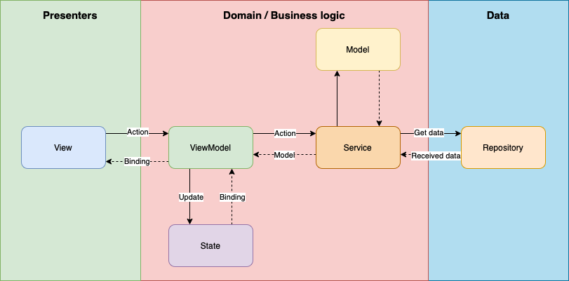

# Simple Movie Flutter Demo App

A demo project which is based on Flutter and build with MVVM and Clear Architecture in mind.

The app uses https://www.themoviedb.org REST API to get the data about movies

## MVVM + [Clean Architecture](https://blog.cleancoder.com/uncle-bob/2012/08/13/the-clean-architecture.html) + [GetX](https://pub.dev/packages/get)

## Description

This app has two screens. The main one is Popular Movie list which fetchs the data from https://api.themoviedb.org `GET /movie/popular` and display the list of items. The second screen is details of movie which gets `movieId` from the main screen then fetch the data from `GET
/movie/{movie_id}` and display the details

## Architecture Overview

## Overview

| Preview           | Live             |
|-------------------|------------------|
|   |  |

## Tests

Run `flutter test`

 